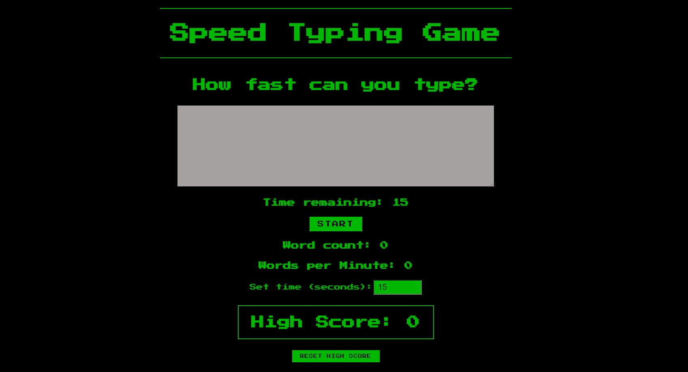

# Speed Typing Game

Ever wonder how fast you type? Well wonder no more! Play the **Speed Typing Game** to find out. View live [here](https://typing-words-per-minute.netlify.app).

## Motivation

I completed the initial version of this app as part of a series of challenges presented in [The React Bootcamp](https://scrimba.com/learn/react). _I thought it could be better_ though, so I added more functionality. Here is a list of additions I made to the original app:

- Words per minute calculations
- Adjustable time setting
- High Score
- Used local storage to retain high score between sessions
- Ability to reset high score

## How to use

The UI is straightforward to use. Initially, the typing window will be gray and unclickable and the high score will be set to zero (see below).

Click start to begin the game. The focus automatically takes the user to the typing window and the clock starts ticking. Below is an image of a game in process where the user already had set a high score previously.

## What I learned

While completing this project I became much more fluent using react hooks (useState, useEffect, useContext, and custom hooks). I also figured out how to access and use localStorage through the window interface.

## Technologies

[React](https://reactjs.org/)

## Credits

[Create React App](https://github.com/facebook/create-react-app),
[The React Bootcamp](https://scrimba.com/learn/react)

## Improvements

As of now, misspelled words show with a red underline, but are still included in the word count. It may improve the user experience to implement a spell check for this app. Additionally, The useLogic custom hook should probably be broken into smaller components.
